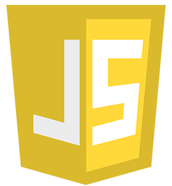
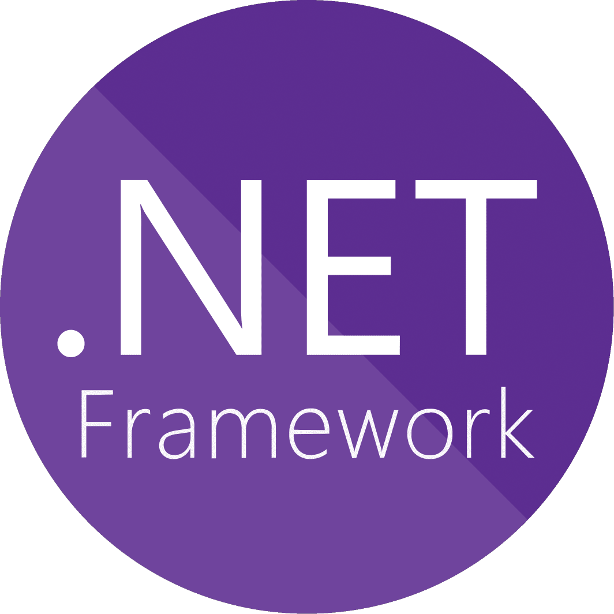
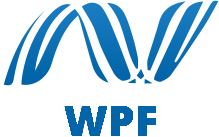
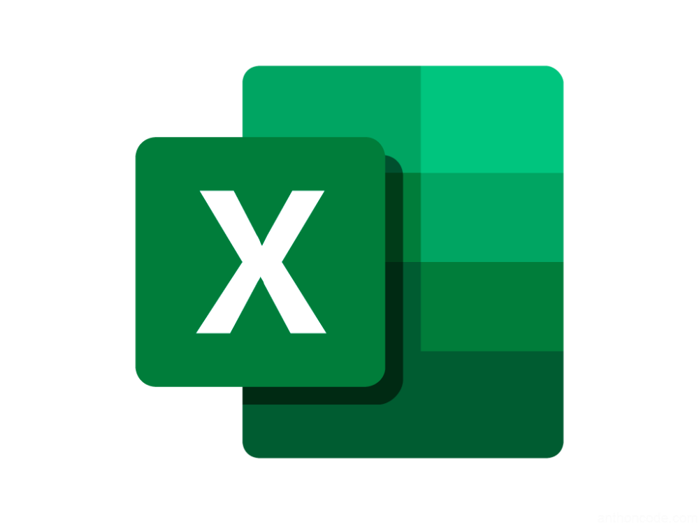

<!-- Your hits or visitors
site: http://hits.dwyl.com or https://visitor-badge.glitch.me
Both apis are in trouble due to the number of requests, if you know any other to register visitors, great
-->
<!-- 

  

 -->

<!-- Your title -->
## Hi, I'm Joel Barrantes, a Backend Developer 🚀 from Perú.

<!-- Your badges
You can use the website to generate badges: https://shields.io/
-->

<!--  -->

&nbsp;

<!-- Talking about you -->
**Talking about Personal Stuffs:**

<!-- Any image aligned to the right. Beware the width -->

- 👨🏽‍💻 I’m currently working on myself
- 🌱 I’m currently improving my knowledge
- 💬 Ask me about anything, I am happy to help
- ⚡️ Fun-Fact: I studied mining engineering
- 📫 How to reach me: joelbarrantespalacios@hotmail.com

**Languages, frameworks and Tools:** 

<!-- Your github readme stats
You can use this api: https://github.com/anuraghazra/github-readme-stats
-->

  <!--  -->

  
  <!-- Your languages and tools. Be careful with the alignment. 
  You can use this sites to get logos: https://www.vectorlogo.zone or https://simpleicons.org/
  -->
  &nbsp;&nbsp;

&nbsp;
&nbsp;
&nbsp;
&nbsp;&nbsp;
&nbsp;&nbsp;

&nbsp;&nbsp;
&nbsp;&nbsp;
&nbsp;&nbsp;
&nbsp;&nbsp;

&nbsp;&nbsp;
&nbsp;&nbsp;&nbsp;
&nbsp;&nbsp;&nbsp;
&nbsp;&nbsp;
&nbsp;
&nbsp;&nbsp;&nbsp;&nbsp;
&nbsp;&nbsp;&nbsp;&nbsp;
&nbsp;&nbsp;&nbsp;&nbsp;&nbsp;
&nbsp;&nbsp;&nbsp;&nbsp;
&nbsp;&nbsp;&nbsp;
&nbsp;&nbsp;
&nbsp;&nbsp;
&nbsp;&nbsp;&nbsp;
&nbsp;&nbsp;&nbsp;
&nbsp;&nbsp;&nbsp;
&nbsp;&nbsp;&nbsp;

## Support me

Well, I would appreciate it if you want to be part of my network. 😁

<!-- Your support, if you have it 
I created these images, feel free to use them.
-->
<!-- 

  
  
  

 -->

---

<!-- ## Best projects -->

<!-- Its main projects -->

  <!--  -->
  <!--  -->

<!-- This readme was created by Murillo Comino - https://github.com/onimur -->
